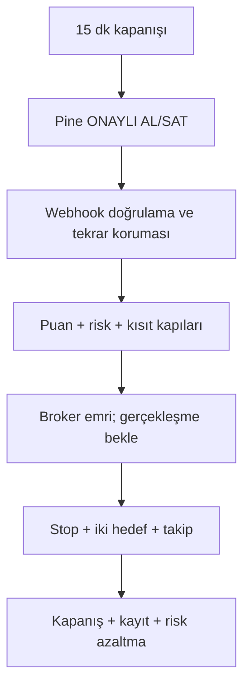

# FinPilot AutoTrader v1

FinPilot AutoTrader v1, Borsa İstanbul için **15 dakikalık kapanmış mum** temelli, uzun yönlü ve gün içi çalışan bir otomatik işlem altyapısıdır. TradingView alarmını doğrular, kuralları tekrar denetler, stop mesafesinden adet hesaplar, emri aracı kurum adaptörüne iletir, gerçek gerçekleşmeyi bekler, koruyucu emirleri yönetir ve sonucu kaydeder.

> Kâr garantisi vermez. Kazanma oranı uydurmaz. Uygulama ilk kurulumda yalnız `PAPER` modunda açılır. Bir adaptör resmî ve tam hesap/emir/pozisyon mutabakatı sağlayamıyorsa canlı emir kapısı açılmaz.

## Çalışan teslimatlar

- Pine Script v6 canlı gösterge: `ÖN AL`, `ONAYLI AL`, `POZİSYONDA`, `ÖN SAT`, `ONAYLI SAT`, `İŞLEM YASAK`, `GÜN KAPATILDI`
- Pine Script v6 kapanmış-mum stratejisi: komisyon, kayma, kısmi hedef, stop, zaman çıkışı, seans sonu, kayıp durum makinesi ve dönem dışı tarih aralığı
- Güvenli TradingView webhook geçidi: Zod doğrulama, ortak anahtar, zaman/nonce kontrolü, tekrar koruması, hız sınırı ve SQLite kalıcı iş kuyruğu
- Açıklanabilir puan motoru: geçen/kalan koşullar ve gerçek değer/eşik karşılaştırması
- Stop mesafesine göre adet: işlem başına `%0,50` normal risk ve sermayenin en fazla `%30`u
- Günlük kayıp tepkisi: ilk kayıpta `%30` azaltma, ikinci kayıpta yarım risk ve yalnız A kalite, üçüncü kayıpta gün kilidi
- Tam işlevli `PaperBroker`: limit/piyasa/stop/stop-limit, kısmi gerçekleşme, kayma, komisyon, ret, iptal, süre dolması ve stop boşluğu
- Resmî şablon içe alan sınırlı `OsmanliWebhookAdapter`; gerçekleşme kanıtı yoksa hiçbir zaman `FILLED` demez
- Matriks IQ ve İdeal için temiz ama resmî SDK/köprü gelene kadar bilinçli olarak kapalı adaptörler
- React + TypeScript Türkçe panel, WebSocket canlı durum, acil durdur, sermaye ayarı ve yazılı canlı mod onayı
- Prisma + SQLite şeması, migration, denetim günlüğü ve yeniden başlatma mutabakatı
- Docker Compose, Windows komut dosyaları, otomatik testler ve 1.000 sentetik mum dayanıklılık simülasyonu

## Hızlı başlangıç — Windows/macOS/Linux

Gereken: Node.js 20.9 veya üzeri.

```bash
cp .env.example .env
npm install
npm run dev
```

Windows Komut İstemi:

```bat
copy .env.example .env
npm install
npm run dev
```

Panel: `http://127.0.0.1:4311`  
API: `http://127.0.0.1:4310`

Kâğıt modundaki yerel `127.0.0.1` bağlantısı varsayılan olarak giriş istemez. Uzak ağ veya canlı kullanımda kimlik doğrulama zorunludur.

## Üretim derlemesi

```bash
npm run check
npm start
```

`npm start`, migration'ları uygular ve derlenmiş API ile paneli `http://127.0.0.1:4310` üzerinde birlikte açar.

## Docker

```bash
cp .env.example .env
docker compose up --build
```

Docker portu güvenlik için yalnız `127.0.0.1:4310` üzerine bağlanır. Harici erişim gerekiyorsa TLS sonlandıran bir ters vekil ve kimlik doğrulama kullanılmalıdır.

## TradingView kurulumu

1. `tradingview/FinPilot_Live_Indicator.pine` dosyasını Pine Editor'e yapıştırıp grafiğe ekleyin.
2. Grafiği **15 dakika** yapın. 1 dakika veya 5 dakika grafik kesin giriş üretmez.
3. Gösterge ayarındaki `Kullanılacak sermaye` değerini girin.
4. En az 32 karakterlik `TV_WEBHOOK_SECRET` değerini gizli `Webhook anahtarı` alanına girin.
5. Alarm türü olarak `Any alert() function call` seçin; webhook adresini `https://SUNUCUNUZ/api/webhooks/tradingview` yapın.
6. Önce yalnız `PAPER` modunda ileriye dönük sonuç biriktirin.

TradingView'de alarm, oluşturulduğu andaki sembol/gösterge/zaman dilimi ayarlarının kopyasıdır. İzlemek istediğiniz her sembol için alarm ayrıca kurulmalıdır. Ayrıntı: [docs/TRADINGVIEW.md](docs/TRADINGVIEW.md).

## İş akışı



## Güvenlikte önemli sınır

`OsmanliWebhookAdapter` yalnız kullanıcının resmî komut sihirbazından aldığı JSON şablonunu doldurur. Özel uç nokta tersine mühendisliği veya uydurma alan yoktur. Bu tür webhook entegrasyonu gerçek emir/pozisyon/gerçekleşme sorgusu vermiyorsa `LIMITED` mutabakat gösterir ve FinPilot canlı modu açmaz. Tam otomasyon için resmî ve çift yönlü SDK/API/terminal köprüsü gerekir.

## Proje yapısı

```text
apps/api/                 Express, WebSocket, webhook, iş kuyruğu, mutabakat
apps/web/                 React Türkçe yönetim paneli
packages/core/            Puan, risk, adet, şema ve ortak tipler
packages/brokers/         Paper ve resmî entegrasyon adaptörleri
prisma/                   SQLite şeması ve migration
tradingview/              Canlı gösterge ve ayrı backtest stratejisi
config/                   Sürümlü strateji, BIST takvimi, kısıt listesi
tests/                    Birim ve davranış testleri
scripts/                  Simülasyon, Pine statik kontrolü, başlatma
docs/                     Kurulum, güvenlik, broker ve sorun giderme
```

## Doğrulama

```bash
npm test
npm run typecheck
npm run check:pine
npm run simulate
npm run build
```

`check:pine` yalnız kaynak üzerinde statik güvenlik kontrolüdür. Pine'ın kesin derlemesi TradingView Pine Editor içinde yapılmalıdır.

## Sonraki belgeler

- [TradingView ve alarm kurulumu](docs/TRADINGVIEW.md)
- [Aracı kurum adaptörleri](docs/BROKERS.md)
- [Windows kurulumu](docs/WINDOWS.md)
- [Kâğıttan canlıya geçiş kontrolü](docs/PAPER-TO-LIVE.md)
- [Güvenlik kontrol listesi](docs/SECURITY-CHECKLIST.md)
- [Sorun giderme](docs/TROUBLESHOOTING.md)

Bu yazılım yatırım danışmanlığı değildir. Yazılım testleri piyasa yönünü, likiditeyi, emir gerçekleşmesini veya kârı garanti etmez.
